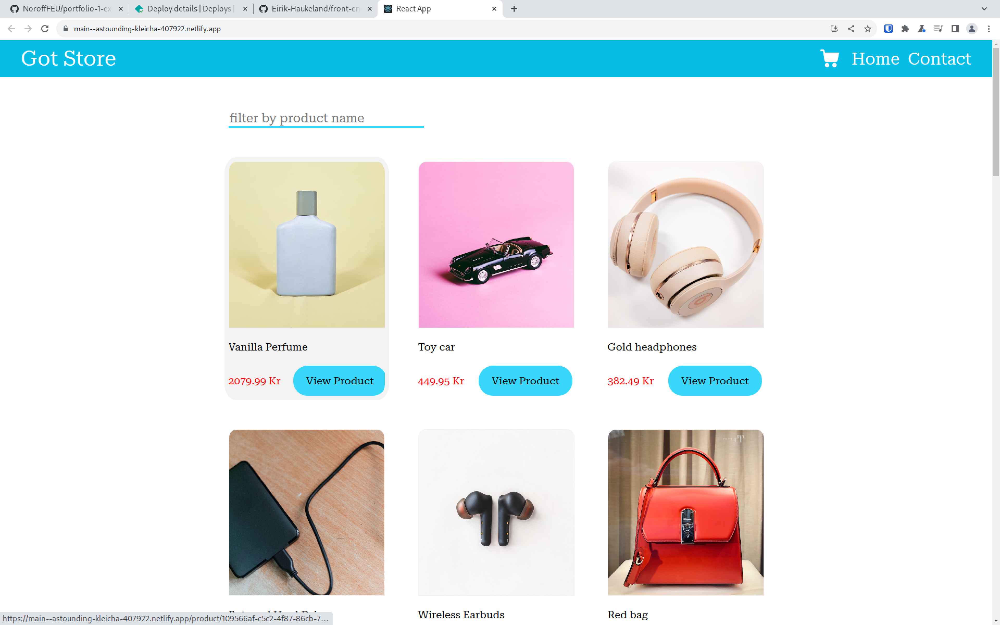

# Getting Started with Create React App

[](https://main--astounding-kleicha-407922.netlify.app/)

## Description

this is an implementation of a shoppingsite using one of noroffs api. it allow you to:
- search for product by name 
- view pordocts
- add poructs to the cart
- remove products from the cart
- simulate a purchase
- simulate sending a message about the store

[link to designe](https://www.figma.com/file/m9S8hxGnIdf7Gbrb8dATun/Untitled?type=design&node-id=28%3A3235&mode=design&t=MXc8ueiGamIdM2cU-1)

## built with

- [Create React App](https://github.com/facebook/create-react-app).
- [react.js](https://react.dev/)
- [react-router-dom](https://reactrouter.com/en/main)

## getting started

### installing

first you need to download the repo
```shell
git clone https://github.com/Eirik-Haukeland/front-end-frameworks-ca
```

then you need to install the dependensies
```shell
npm install
```

### running

In the project directory, you can run:

```shell
npm start
```

Runs the app in the development mode.\
Open [http://localhost:3000](http://localhost:3000) to view it in your browser.

The page will reload when you make changes.\
You may also see any lint errors in the console.

```shell
npm test
```

Launches the test runner in the interactive watch mode.\
See the section about [running tests](https://facebook.github.io/create-react-app/docs/running-tests) for more information.

## Contributing

this project is not beeing activly developped, but if you want to suggest canges please open an issue where you describe the problem you want to solve and the proposed sulution. submitt the changes to a pr and link the pr to the issue
